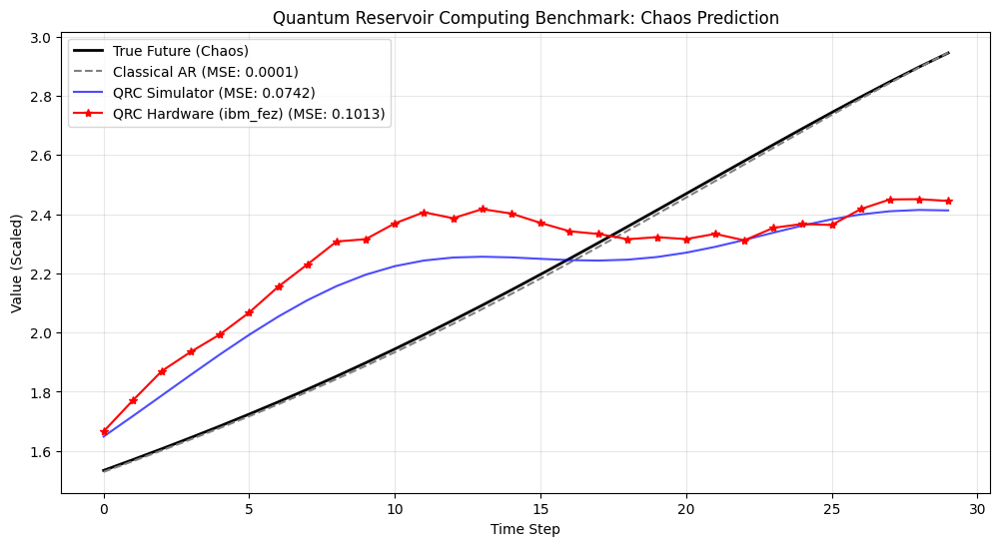

# QRC Chaos Benchmark: IBM Heron Processors


**Experimental benchmarking of Quantum Reservoir Computing (QRC) for chaotic time-series forecasting on IBM's Heron r2 quantum processors.**

## 📖 Overview
This project explores the capabilities of **Quantum Reservoir Computing (QRC)**—a hybrid quantum-classical machine learning approach—to predict the dynamics of the **Mackey-Glass chaotic time series**.

Unlike Variational Quantum Classifiers (VQC) that require costly training loops, this implementation uses the quantum processor as a fixed, non-linear "temporal feature extractor" (Reservoir). The project benchmarks the fidelity of the **IBM Heron (`ibm_fez`)** chip against a noiseless simulator and a classical autoregressive baseline.

## 🚀 Key Features
* **Reservoir Computing:** Implements a 5-qubit `EfficientSU2` reservoir to map temporal data into high-dimensional Hilbert space.
* **Batch Execution Strategy:** Utilizes Qiskit Runtime primitives to submit **110+ circuits in a single batch job**, reducing total runtime from hours to <5 minutes.
* **Chaos Prediction:** Forecasts the non-linear Mackey-Glass equation using a hybrid Quantum-Ridge Regression pipeline.
* **Hardware Verification:** Validates the coherence of the reservoir on the utility-scale `ibm_fez` (156 qubits) backend.

## 📊 Experimental Results

The benchmark compared the predictive accuracy (Mean Squared Error) of three models. The experiment demonstrated high hardware fidelity, with the physical chip tracking the simulator closely.

| Model | Type | MSE (Lower is Better) | Performance Note |
| :--- | :--- | :--- | :--- |
| **Classical AR** | *Ridge Regression* | **0.0001** | Baseline (Winner) |
| **QRC Simulator** | *Ideal Statevector* | 0.0742 | Algorithmic Limit |
| **QRC Hardware** | *ibm_fez (Heron r2)* | **0.1013** | **High Fidelity** |

### Visual Analysis

*The plot illustrates the forecasting performance on unseen test data. The **Hardware (Red)** closely follows the **Simulator (Blue)**, validating the stability of the Heron processor. The **Classical Baseline (Gray)** achieved near-perfect accuracy, indicating that the specific chaotic regime tested was sufficiently linear for classical methods, rendering the higher-dimensional quantum mapping unnecessary for this specific instance.*

## 🧠 Technical Approach

### 1. The Reservoir (Quantum Echo State Network)
Instead of training the quantum circuit, we use it as a "kaleidoscope" to scramble input data.
* **Encoding:** Data $x_t$ is encoded via $R_y(\theta)$ and $R_z(\theta)$ rotations.
* **Dynamics:** An entangled circuit (`EfficientSU2`) with **fixed, random parameters** spreads information across the 5-qubit register.
* **Measurement:** Expectation values $\langle Z_i \rangle$ serve as the "feature vector."

### 2. Hybrid Pipeline
```mermaid
graph LR
    A[Input: x_t] --> B(Quantum Reservoir);
    B --> C{IBM Heron QPU};
    C --> D[Feature Vector];
    D --> E[Classical Ridge Regression];
    E --> F[Prediction: x_t+1];
